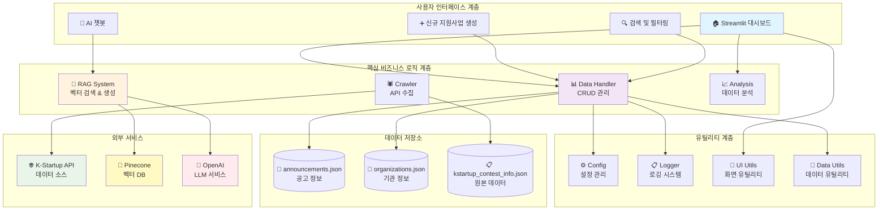
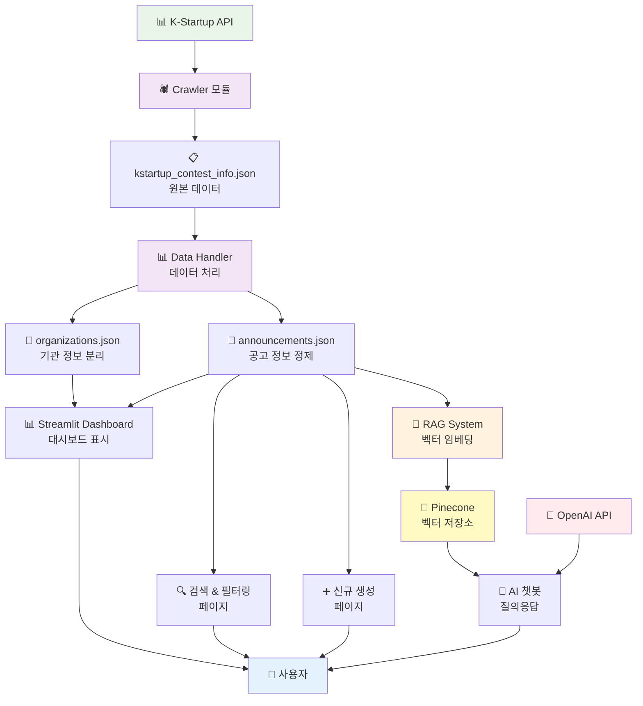
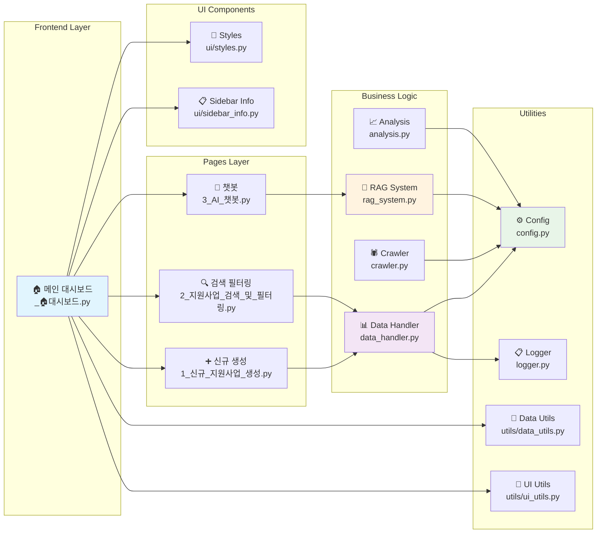
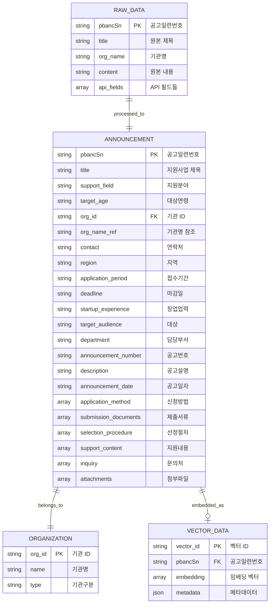
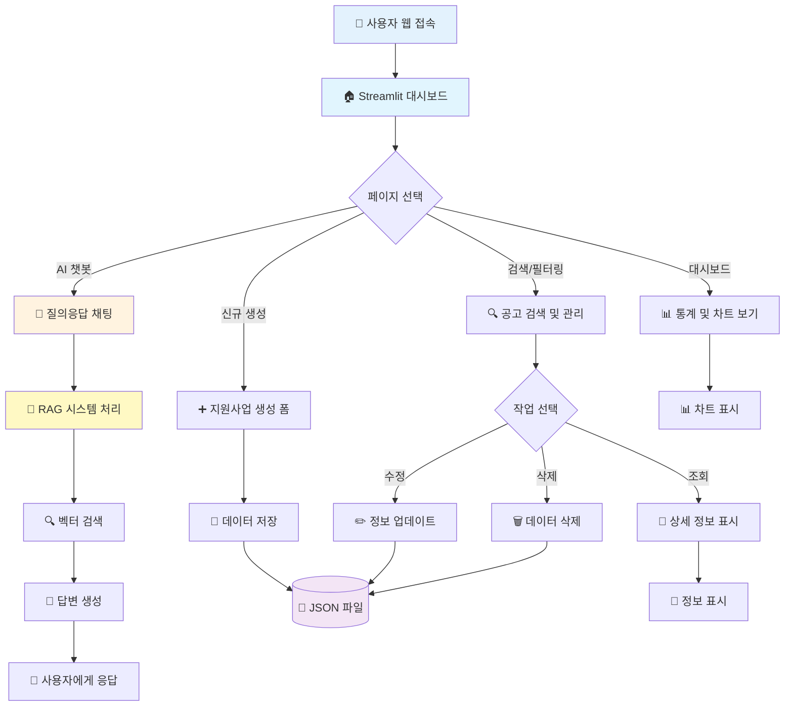
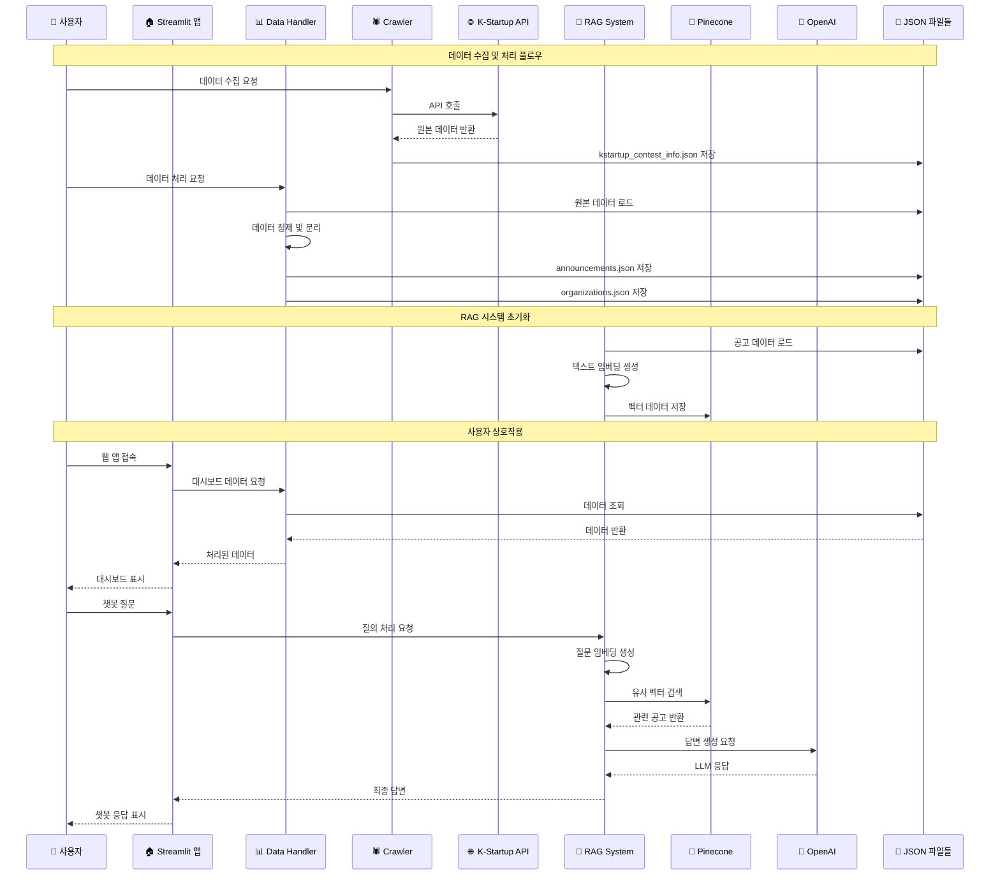

# K-Startup 지원사업 관리 시스템 아키텍처

## 📋 개요

K-Startup 지원사업 관리 시스템은 한국창업진흥원의 지원사업 정보를 효율적으로 관리하고 사용자에게 제공하는 웹 기반 플랫폼입니다. Streamlit 기반의 웹 애플리케이션을 제공하며, RAG(Retrieval-Augmented Generation) 기술을 활용한 AI 챗봇을 통해 지능형 질의응답 서비스를 제공합니다.

### 🎯 주요 기능

- 📊 **실시간 대시보드**: 지원사업 통계 및 시각화
- ➕ **CRUD 기능**: 지원사업 생성, 조회, 수정, 삭제
- 🔍 **고급 검색**: 키워드 및 필터 기반 검색
- 🤖 **AI 챗봇**: RAG 기반 지능형 상담 서비스
- 📈 **데이터 분석**: 기관별 공고 빈도 분석

---

## 🏗️ 전체 시스템 아키텍처



---

## 🔄 데이터 흐름도



---

## 🧩 컴포넌트 구조도



---

## 🗄️ 데이터베이스 스키마



---

## 👤 사용자 플로우



---

## ⚡ 시퀀스 다이어그램



---

## 📁 파일 구조

```
dsc1/
├── 📱 _🏠대시보드.py              # Streamlit 메인 앱
├── 📊 data_handler.py              # 데이터 CRUD 관리
├── 🕷️ crawler.py                   # K-Startup API 크롤러
├── 🤖 rag_system.py                # RAG 챗봇 시스템
├── 📈 analysis.py                  # 데이터 분석 모듈
├── ⚙️ config.py                    # 설정 관리
├── 📋 logger.py                    # 로깅 시스템
│
├── 📄 데이터 파일/
│   ├── announcements.json         # 공고 정보
│   ├── organizations.json         # 기관 정보
│   └── kstartup_contest_info.json # 원본 데이터
│
├── 📱 pages/                       # Streamlit 페이지
│   ├── 1_➕_신규_지원사업_생성.py
│   ├── 2_🔍_지원사업_검색_및_필터링.py
│   └── 3_🤖_AI_챗봇.py
│
├── 🎨 ui/                          # UI 컴포넌트
│   ├── styles.py                  # 스타일 관리
│   └── sidebar_info.py            # 사이드바 정보
│
├── 🔧 utils/                       # 유틸리티
│   ├── data_utils.py              # 데이터 유틸리티
│   └── ui_utils.py                # UI 유틸리티
│
└── 📋 requirements.txt             # 의존성 관리
```

---

## 🔧 기술 스택

### 🖥️ Frontend

- **Streamlit**: 웹 애플리케이션 프레임워크
- **Plotly**: 데이터 시각화
- **Rich**: 콘솔 출력 개선

### 🔗 Backend

- **Python 3.11+**: 메인 프로그래밍 언어
- **FastAPI**: REST API (필요시)
- **Pandas**: 데이터 처리
- **NumPy**: 수치 연산

### 🤖 AI/ML

- **OpenAI GPT**: 대화형 AI
- **Pinecone**: 벡터 데이터베이스
- **Sentence Transformers**: 텍스트 임베딩
- **LangChain**: LLM 체인 관리

### 💾 데이터

- **JSON**: 로컬 데이터 저장
- **Requests**: HTTP API 통신
- **Beautiful Soup**: 웹 스크래핑 (필요시)

### 🔧 개발 도구

- **Git**: 버전 관리
- **Poetry/pip**: 의존성 관리
- **Black**: 코드 포매팅
- **Pytest**: 테스트 프레임워크

---

## 🔑 핵심 설계 원칙

### 1. 📐 계층형 아키텍처

- **프레젠테이션 계층**: Streamlit 웹 UI
- **비즈니스 로직 계층**: 데이터 처리 및 분석
- **데이터 접근 계층**: JSON 파일 관리
- **외부 서비스 계층**: API 통신 및 벡터 DB

### 2. 🔒 단일 책임 원칙

- 각 모듈은 명확한 단일 책임을 가짐
- 데이터 처리, UI 렌더링, API 통신 분리
- 재사용 가능한 컴포넌트 설계

### 3. 🔄 데이터 흐름 관리

- 단방향 데이터 흐름
- 중앙집중식 상태 관리
- 캐싱을 통한 성능 최적화

### 4. 🛡️ 오류 처리 및 로깅

- 체계적인 예외 처리
- 구조화된 로깅 시스템
- 사용자 친화적 오류 메시지

### 5. 🔌 확장성 고려

- 모듈형 설계로 기능 추가 용이
- 플러그인 아키텍처 준비
- 마이크로서비스 전환 가능성

---

## 🚀 배포 및 운영

### 📦 배포 방식

- **로컬 개발**: `streamlit run _🏠대시보드.py`
- **Docker 컨테이너**: 컨테이너화 준비
- **클라우드 배포**: Streamlit Cloud, AWS, GCP

### 📊 모니터링

- 애플리케이션 로그 모니터링
- API 호출 성능 추적
- 사용자 행동 분석

### 🔐 보안

- API 키 환경변수 관리
- 데이터 입력 검증 및 sanitization
- HTTPS 통신 강제

---

## 🛠️ 개발 및 유지보수 가이드

### 📝 코드 품질

- PEP 8 스타일 가이드 준수
- 타입 힌팅 적극 활용
- 단위 테스트 및 통합 테스트

### 📖 문서화

- 모든 함수/클래스 Docstring 작성
- API 문서 자동 생성
- 사용자 매뉴얼 유지

### 🔄 CI/CD

- GitHub Actions 워크플로우
- 자동 테스트 실행
- 코드 품질 검사

이 아키텍처 문서는 시스템의 전체적인 구조와 설계 철학을 제공하며, 개발팀의 효율적인 협업과 시스템 유지보수를 지원합니다.
