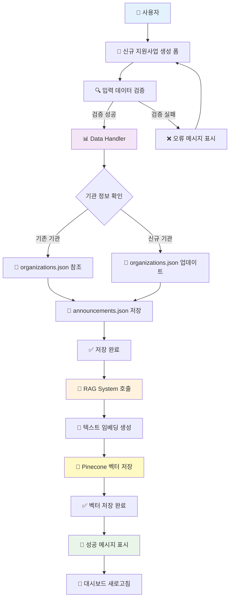
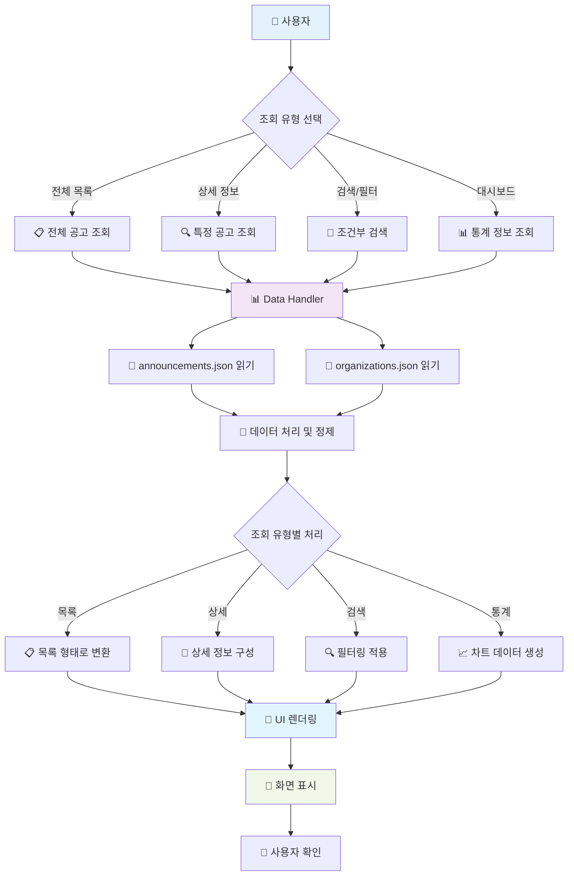
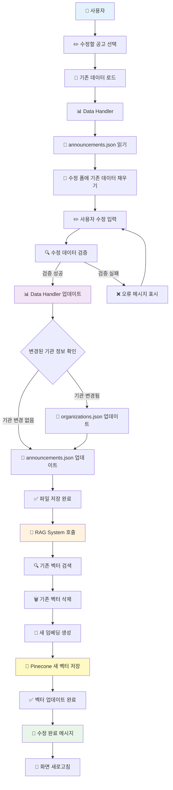
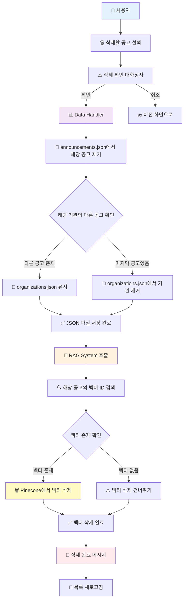
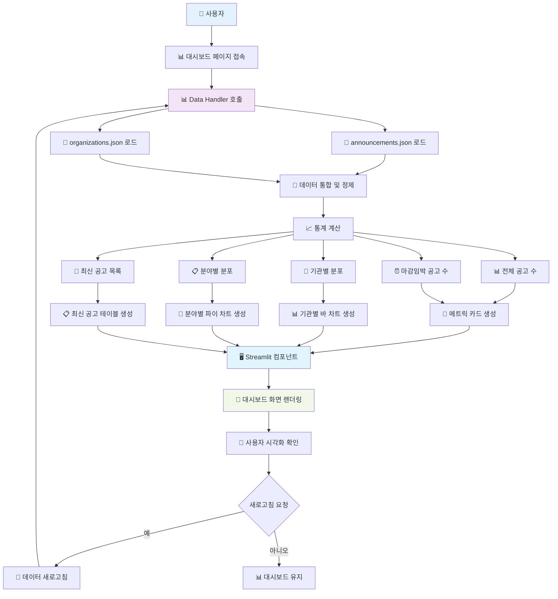
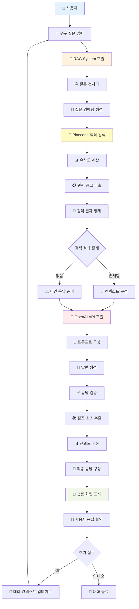

# K-Startup 지원사업 관리 시스템 - CRUD 데이터 흐름

## 📋 개요

본 문서는 K-Startup 지원사업 관리 시스템에서 **Create, Read, Update, Delete** 작업 시 발생하는 모든 데이터의 흐름을 상세히 설명합니다. 각 작업은 Streamlit 웹 인터페이스를 통해 수행되며, 다음 데이터 저장소들과 상호작용합니다:

- 📄 **announcements.json**: 공고 정보 저장
- 🏢 **organizations.json**: 기관 정보 저장
- 📋 **kstartup_contest_info.json**: 원본 API 데이터
- 🔗 **Pinecone**: 벡터 데이터베이스

---

## ➕ CREATE - 신규 지원사업 생성

### 📊 데이터 흐름도

### 🔄 단계별 처리 과정

1. **📝 사용자 입력**

   - 지원사업 제목, 기관명, 설명, 마감일 등 입력
   - Streamlit 폼 컴포넌트를 통한 데이터 수집

2. **🔍 데이터 검증**

   - 필수 필드 입력 확인
   - 날짜 형식 유효성 검사
   - 중복 공고 확인

3. **🏢 기관 정보 처리**

   - 기존 기관인지 확인 (`organizations.json` 조회)
   - 신규 기관인 경우 기관 정보 추가
   - 기관 ID 생성 및 매핑

4. **📄 공고 정보 저장**

   - 고유 ID (pbancSn) 생성
   - `announcements.json`에 새 공고 정보 저장
   - 백업 파일 생성

5. **🤖 벡터 임베딩**

   - 공고 제목 + 설명 텍스트 임베딩 생성
   - Sentence Transformers 모델 활용
   - 메타데이터 구성

6. **🔗 벡터 저장**
   - Pinecone에 임베딩 벡터 저장
   - 공고 ID와 벡터 ID 매핑
   - 검색 최적화를 위한 인덱싱

---

## 📖 READ - 조회 및 검색

### 📊 데이터 흐름도

### 🔄 단계별 처리 과정

1. **📱 조회 요청**

   - 대시보드, 검색페이지, 상세페이지 접근
   - 사용자 조회 유형 선택

2. **📊 데이터 로드**

   - `announcements.json` 파일 읽기
   - `organizations.json` 파일 읽기
   - 캐싱을 통한 성능 최적화

3. **🔗 데이터 조인**

   - 공고 정보와 기관 정보 매핑
   - 외래키 (org_id) 기반 관계 설정

4. **🔍 필터링 및 정렬**

   - 검색 키워드 적용
   - 기관, 지역, 분야별 필터링
   - 마감일, 등록일 기준 정렬

5. **📈 데이터 변환**

   - UI 표시에 적합한 형태로 변환
   - 차트 데이터 구성 (대시보드)
   - 페이지네이션 적용

6. **🎨 UI 렌더링**
   - Streamlit 컴포넌트로 표시
   - 테이블, 카드, 차트 형태 선택
   - 반응형 레이아웃 적용

---

## ✏️ UPDATE - 수정

### 📊 데이터 흐름도

### 🔄 단계별 처리 과정

1. **✏️ 수정 대상 선택**

   - 공고 목록에서 수정 버튼 클릭
   - 공고 ID (pbancSn) 기반 식별

2. **📖 기존 데이터 로드**

   - `announcements.json`에서 해당 공고 정보 조회
   - 관련 기관 정보 함께 로드

3. **📝 수정 폼 구성**

   - 기존 데이터로 폼 필드 채우기
   - 수정 가능한 필드와 읽기 전용 필드 구분

4. **🔍 수정 데이터 검증**

   - 변경된 내용 유효성 검사
   - 필수 필드 및 형식 검증
   - 중복 확인

5. **🏢 기관 정보 업데이트**

   - 기관명 변경 시 기관 정보 업데이트
   - 신규 기관인 경우 `organizations.json`에 추가

6. **📄 공고 정보 업데이트**

   - `announcements.json`에서 해당 공고 정보 수정
   - 수정 시간 (updated_at) 갱신

7. **🤖 벡터 업데이트**
   - 기존 벡터 삭제 후 새 벡터 생성
   - 텍스트 변경 시에만 벡터 업데이트 수행
   - Pinecone에서 upsert 작업

---

## 🗑️ DELETE - 삭제

### 📊 데이터 흐름도

### 🔄 단계별 처리 과정

1. **🗑️ 삭제 대상 선택**

   - 공고 목록에서 삭제 버튼 클릭
   - 공고 ID (pbancSn) 기반 식별

2. **⚠️ 삭제 확인**

   - 사용자에게 삭제 확인 대화상자 표시
   - 실수 방지를 위한 안전장치

3. **📄 공고 정보 삭제**

   - `announcements.json`에서 해당 공고 제거
   - 삭제 전 백업 생성

4. **🏢 기관 정보 정리**

   - 해당 기관의 다른 공고 존재 여부 확인
   - 마지막 공고인 경우 기관 정보도 삭제
   - 참조 무결성 유지

5. **🔍 벡터 정보 확인**

   - Pinecone에서 해당 공고의 벡터 ID 검색
   - 벡터 존재 여부 확인

6. **🗑️ 벡터 삭제**

   - Pinecone에서 해당 벡터 완전 삭제
   - 검색 인덱스에서 제거

7. **💚 완료 처리**
   - 삭제 완료 메시지 표시
   - 목록 화면 새로고침
   - 사용자에게 결과 피드백

---

## 📊 VISUALIZATION - 대시보드 시각화

### 📊 데이터 흐름도

### 🔄 단계별 처리 과정

1. **📊 대시보드 초기화**

   - 사용자가 대시보드 페이지 접속
   - Streamlit 캐싱 시스템 활용

2. **📄 데이터 로딩**

   - `announcements.json` 파일 읽기
   - `organizations.json` 파일 읽기
   - 데이터 무결성 검증

3. **🔄 데이터 통합**

   - 공고와 기관 정보 조인
   - 마감일 기준 상태 분류
   - 데이터 정제 및 변환

4. **📈 통계 계산**

   - **전체 공고 수**: 등록된 총 공고 개수
   - **마감임박 공고**: 7일 이내 마감 공고
   - **기관별 분포**: 상위 10개 기관별 공고 수
   - **분야별 분포**: 지원분야별 공고 분포
   - **최신 공고**: 최근 등록된 5개 공고

5. **🎨 시각화 컴포넌트 생성**

   - **메트릭 카드**: `st.metric()` 활용
   - **바 차트**: 기관별 공고 수 (Plotly)
   - **파이 차트**: 분야별 분포 (Plotly)
   - **데이터 테이블**: 최신 공고 목록

6. **📱 화면 렌더링**
   - Streamlit 레이아웃 구성
   - 반응형 컬럼 배치
   - 인터랙티브 차트 표시

---

## 🤖 CHATBOT - AI 질의응답

### 📊 데이터 흐름도

### 🔄 단계별 처리 과정

1. **💬 질문 입력**

   - 사용자가 자연어 질문 입력
   - Streamlit `st.chat_input()` 활용

2. **🔍 질문 전처리**

   - 텍스트 정제 (특수문자, 공백 처리)
   - 질문 길이 제한 확인
   - 언어 감지 및 검증

3. **📝 임베딩 생성**

   - Sentence Transformers 모델 활용
   - 질문을 벡터로 변환
   - 임베딩 차원 정규화

4. **🔗 벡터 검색**

   - Pinecone에서 유사 벡터 검색
   - 코사인 유사도 계산
   - Top-K 결과 추출 (기본값: 5개)

5. **📋 결과 정제**

   - 유사도 임계값 적용 (0.7 이상)
   - 중복 공고 제거
   - 마감일 기준 정렬

6. **📝 컨텍스트 구성**

   - 검색된 공고 정보 요약
   - 관련 기관 정보 포함
   - 프롬프트 템플릿 적용

7. **🧠 LLM 답변 생성**

   - OpenAI GPT 모델 호출
   - 컨텍스트 기반 답변 생성
   - 안전성 필터링 적용

8. **📚 응답 후처리**

   - 참조 소스 링크 추가
   - 신뢰도 점수 계산
   - 답변 포맷팅

9. **💬 응답 표시**

   - 챗봇 UI에 답변 표시
   - 참조 공고 정보 제공
   - 추가 질문 유도

10. **📝 대화 관리**
    - 대화 히스토리 저장
    - 컨텍스트 메모리 관리
    - 세션 상태 유지

---

## 🔐 데이터 무결성 보장

### 📋 트랜잭션 관리

각 CRUD 작업은 다음과 같은 방식으로 데이터 일관성을 보장합니다:

1. **🔒 원자적 연산**

   - JSON 파일 저장과 벡터 업데이트를 순차적으로 처리
   - 중간 실패 시 롤백 메커니즘

2. **💾 백업 및 복구**

   - 수정/삭제 전 자동 백업 생성
   - 오류 발생 시 이전 상태로 복구

3. **🔍 참조 무결성**

   - 기관-공고 간 관계 일관성 유지
   - 외래키 제약 조건 검증

4. **📝 로깅**
   - 모든 CRUD 작업 로그 기록
   - 오류 추적 및 디버깅 지원

---

## ⚡ 성능 최적화

### 🚀 최적화 전략

1. **📦 캐싱**

   - Streamlit `@st.cache_data` 활용
   - 자주 조회되는 데이터 메모리 캐싱

2. **🔄 배치 처리**

   - 여러 벡터 한 번에 처리
   - Pinecone upsert 배치 작업

3. **📊 지연 로딩**

   - 필요시에만 데이터 로드
   - 페이지네이션으로 메모리 절약

4. **🔍 인덱싱**
   - 자주 검색되는 필드 최적화
   - Pinecone 벡터 인덱스 활용

이 문서는 K-Startup 지원사업 관리 시스템의 모든 CRUD 작업에 대한 완전한 데이터 흐름을 제공하며, 개발자가 시스템의 동작을 이해하고 디버깅할 때 유용한 참고 자료가 됩니다.
